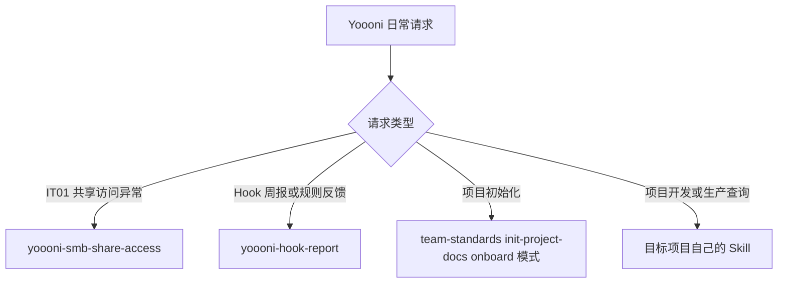

# yoooni-daily-plugin

Yoooni 日常辅助插件。它不是主路由，也不承载项目开发、通用 onboarding、环境搭建、生产系统查询或团队工具安装流程。

## 当前 Skill

插件只保留 2 个明确属于 Yoooni 日常协作的入口：

| Skill | 用途 | 边界 |
|---|---|---|
| `yoooni-smb-share-access` | 诊断或修复受控公司内网中的 IT01 SMB 访问 | 只处理网络、凭据、Guest 和安全策略，不负责 SVN 入职流程 |
| `yoooni-hook-report` | 汇总 Hook 命中、warn、纠正和脱敏 Prompt 信号 | 只生成团队反馈，不修改规范或业务项目 |



## 已下沉能力

| 原能力 | 当前归属 |
|---|---|
| 新项目九阶段 onboarding | `team-standards:init-project-docs` 的 `onboard` 模式 |
| 新同事 SVN 入职 | 公司或目标项目自己的入职说明 |
| 生产接口日志查询 | 对应生产系统项目自己的只读 Skill |
| 团队工具安装与更新 | 仓库 `scripts/` 维护命令，不作为 Agent Skill |
| IDEA、JDK、Resin、Redis、Oracle 与应用启动 | 目标项目自己的 README、Skill 或脚本 |
| DDL 基线 | 按目标项目授权只读查询测试环境真实 Schema |

## 仓库维护脚本

这些脚本服务于插件安装和维护，但不会被当作 Skill 自动触发：

```text
plugins/yoooni-daily-plugin/scripts/
├── bootstrap-install.ps1 / .sh
├── install-team-tools.ps1 / .sh
├── update-team-tools.ps1 / .sh
├── check-team-tools.ps1
├── register-autoupdate-task.ps1 / .sh
└── uninstall-team-tools.ps1 / .sh
```

默认不在 `SessionStart` 自动更新，也不默认创建计划任务。定时更新必须由用户显式配置。

## 安装

```text
/plugin marketplace add https://gitee.com/wyoooni/yoooni-daily-plugin.git
/plugin install yoooni-daily-plugin@yoooni-daily-plugin
/reload-plugins
```

整套工具首次安装使用仓库发布包或：

```powershell
powershell -ExecutionPolicy Bypass -File plugins/yoooni-daily-plugin/scripts/bootstrap-install.ps1
```

## 验证

```powershell
# PowerShell 缓存版本与更新锁测试
plugins/yoooni-daily-plugin/scripts/tests/check-team-tools.tests.ps1
plugins/yoooni-daily-plugin/scripts/tests/update-lock.tests.ps1
```

```bash
# Hook 测试
cd plugins/yoooni-daily-plugin/hooks
npm test
```

插件版本由 marketplace、Claude plugin 和 Codex plugin 三处 manifest 共同声明，必须保持一致。`check-team-tools.ps1` 还会比较工作区版本与 Codex 缓存中的最高 SemVer；缓存存在但版本落后时会要求更新和重启。
