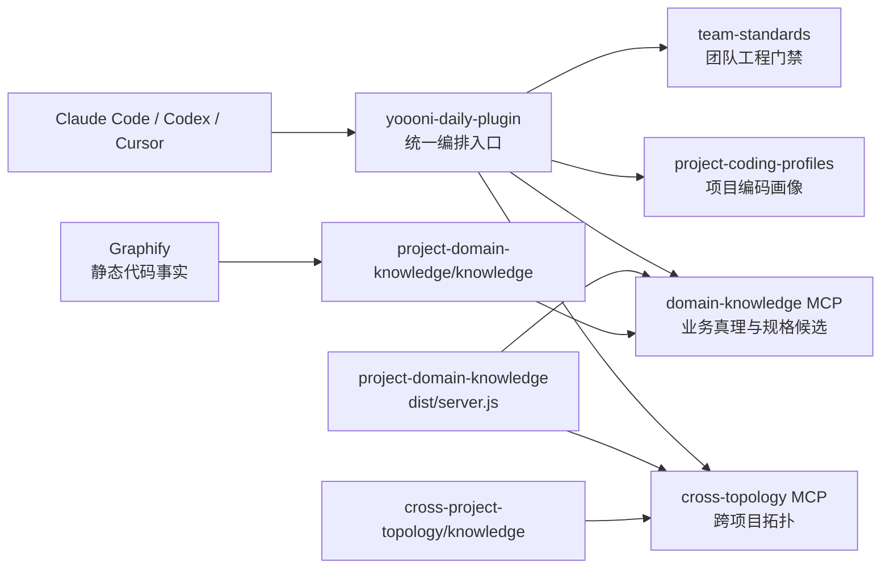

# yoooni-daily-plugin

Yoooni 团队工具链的统一入口。它把新同事入职、项目初始化、ERP 受控开发、生产排障，以及整套 Plugin/MCP 的安装与更新编排成可直接触发的工作流。

> 本仓库负责“怎么把能力串起来”，不复制下层能力：工程门禁归 `team-standards`，项目写法归 `project-coding-profiles`，业务认知与规格候选归 `project-domain-knowledge`，跨系统连接归 `cross-project-topology`。

## 快速导航

- [工具链全景](#工具链全景)：五个仓库如何协作
- [核心能力](#核心能力)：这套入口能完成什么
- [快速安装](#快速安装)：单独安装或全新机器一键装齐
- [新项目初始化](#新项目初始化)：从源码到可验证规格的十阶段流程
- [Skills](#skills)：13 个可直接触发的工作流
- [自动更新与安全](#自动更新与安全)：版本同步、锁、日志和凭据策略
- [维护与验证](#维护与验证)：仓库结构和自检入口

---

## 工具链全景

整套工具由 **3 个 Plugin、1 个 MCP 引擎和 2 个 MCP 实例**组成：

| 组件 | 形态 | 负责什么 |
|---|---|---|
| `yoooni-daily-plugin` | Plugin | 安装、更新、入职、项目 onboarding、ERP 开发与日常作业编排 |
| `team-standards` | Plugin | 需求、设计、架构、编码、文档、提交和知识沉淀门禁 |
| `project-coding-profiles` | Plugin | 项目专属编码、框架、脚手架、URL 定位和写盘保护 |
| `project-domain-knowledge` | MCP 引擎 + 知识仓 | 业务真理、菜单定位、对象中心规格挖掘和候选评审 |
| `cross-project-topology` | MCP 数据仓 | 跨项目调用链、数据流、接口契约和服务地图 |



关键设计只有两条：

- **能力分层，不重复造轮子**：上层 Skill 只负责编排，下层仓库保持各自单一职责。
- **一个引擎，两个知识域**：两个 MCP 实例复用 `project-domain-knowledge/dist/server.js`，通过 `DOMAIN_KB_DIR` 隔离业务真理与跨项目拓扑。

---

## 核心能力

### 团队工具生命周期

- 一键安装三个 Plugin、两个 MCP 实例及其源码仓库。
- SessionStart 后台刷新与会话外定时更新互补。
- 幂等安装、按需构建、MCP 重注册和版本过期提醒。
- Windows Mutex、macOS/Linux PID 锁避免并发更新互相破坏。

### 新人和本地环境

- SVN 拉取公司项目文档。
- 修复受控公司内网下的 SMB 访问。
- IDEA、JDK 1.8、Resin4、Redis、Oracle 环境搭建与日常启动。

### 项目初始化与知识基线

- 生成 Agent 入口、编码画像和跨目录任务空间。
- 调用 Graphify 建立静态代码事实层。
- 按模块起草业务真理、DDL 基线和对象中心 Core Spec 候选。
- 将跨项目调用关系登记到独立拓扑库，并做最终健康检查。

### ERP 受控开发

- 从菜单 URL 或 `*.action` 定位前后端代码。
- 先查业务真理、字段语义、状态迁移和共用 Service 副作用，再改代码。
- 验收覆盖上游、当前操作、数据库终态和至少一个下一业务动作。

### 生产与团队反馈

- 以 DPAPI 保护凭据，查询并脱敏保存生产接口日志。
- 聚合 Hook 命中和脱敏后的 Prompt 信号，形成规则与知识缺口候选。

---

## 快速安装

### 已有 Claude Code，只安装本插件

```text
/plugin marketplace add https://gitee.com/wyoooni/yoooni-daily-plugin.git
/plugin install yoooni-daily-plugin@yoooni-daily-plugin
/reload-plugins
```

安装完成后可以直接说：

```text
安装公司团队工具
初始化一个新项目
开发一个 ERP 小需求
查询生产接口日志
```

### 全新机器，一键装齐公司套件

前置依赖：Git 必需，Node.js 18+ 与 Claude Code CLI 建议安装。

1. 获取并解压 `公司团队套件-一键安装卸载.zip`。
2. Windows 双击 `team-tools-install.cmd`；macOS/Linux 运行 `bootstrap-install.sh`。
3. 首次访问公司私有 Gitee 时完成登录。
4. 安装完成后重启会话或执行 `/reload-plugins`。

脚本会安装或注册：

- `yoooni-daily-plugin`
- `team-standards`
- `project-coding-profiles`
- `domain-knowledge` MCP
- `cross-topology` MCP

安装过程是幂等的：已存在的仓库、插件和 MCP 会跳过，更新由独立更新流程负责。卸载使用 `team-tools-uninstall.cmd`，默认保留已下载源码。

---

## 新项目初始化

`yoooni-onboard-pipeline` 将一个遗留项目接入团队工具链时按十个阶段推进：


其中机械步骤可以自动执行；业务真理、状态语义、规格冲突和候选晋升必须保留 owner 评审。Graphify 是静态事实层，运行日志/历史数据是动态证据层，二者共同支撑 Core Spec，而不是互相替代。

---

## Skills

当前插件提供 13 个 Skill。详细规则以各自 `SKILL.md` 为准，README 只保留发现入口。

| 场景 | Skill | 作用 |
|---|---|---|
| 新人入职 | [`yoooni-onboard-init`](plugins/yoooni-daily-plugin/skills/yoooni-onboard-init/SKILL.md) | 通过 SVN 首次拉取公司项目文档 |
| 内网共享 | [`yoooni-smb-share-access`](plugins/yoooni-daily-plugin/skills/yoooni-smb-share-access/SKILL.md) | 诊断或修复 `\\IT01` SMB 访问 |
| 首次搭建 | [`yoooni-idea-import`](plugins/yoooni-daily-plugin/skills/yoooni-idea-import/SKILL.md) | 导入 Yoooni 并搭建 Resin 环境 |
| 日常启动 | [`yoooni-start`](plugins/yoooni-daily-plugin/skills/yoooni-start/SKILL.md) | 检查 Redis、Oracle 并启动 Yoooni |
| 套件安装 | [`yoooni-install-team-tools`](plugins/yoooni-daily-plugin/skills/yoooni-install-team-tools/SKILL.md) | 安装关联 Plugin 与 MCP |
| 套件更新 | [`yoooni-update-team-tools`](plugins/yoooni-daily-plugin/skills/yoooni-update-team-tools/SKILL.md) | 同步源码、构建引擎并刷新注册 |
| 生产排障 | [`yoooni-prod-log-query`](plugins/yoooni-daily-plugin/skills/yoooni-prod-log-query/SKILL.md) | 查询生产后台接口日志 |
| 多仓工作区 | [`yoooni-taskspace`](plugins/yoooni-daily-plugin/skills/yoooni-taskspace/SKILL.md) | 用 junction/symlink 聚合独立仓库 |
| 团队反馈 | [`yoooni-hook-report`](plugins/yoooni-daily-plugin/skills/yoooni-hook-report/SKILL.md) | 汇总规则命中和疑问纠正信号 |
| 新项目接入 | [`yoooni-onboard-pipeline`](plugins/yoooni-daily-plugin/skills/yoooni-onboard-pipeline/SKILL.md) | 编排十阶段项目初始化流水线 |
| 业务知识冷启动 | [`domain-knowledge-bootstrap`](plugins/yoooni-daily-plugin/skills/domain-knowledge-bootstrap/SKILL.md) | 转交权威流程，按模块起草业务真理 |
| ERP 需求开发 | [`yoooni-erp-auto-dev`](plugins/yoooni-daily-plugin/skills/yoooni-erp-auto-dev/SKILL.md) | 定位、查真相、规格挖掘、改码和风险分级的最小充分验证 |
| 工作台脚手架 | [`yoooni-devmodule-scaffold`](plugins/yoooni-daily-plugin/skills/yoooni-devmodule-scaffold/SKILL.md) | 按 ERP 范式生成需求开发工作台模块 |

新人环境链路是：

```text
yoooni-onboard-init
  -> yoooni-smb-share-access
  -> yoooni-idea-import
  -> yoooni-start
```

“初始化新项目”与“新同事入职”是两条不同流程：前者使用 `yoooni-onboard-pipeline`，后者才使用 `yoooni-onboard-init`。

---

## 自动更新与安全

### 更新机制

- `SessionStart` 每天最多触发一次后台刷新，不阻塞当前会话。
- Windows 一键引导安装当前默认每 1 小时注册一次计划任务；直接运行 `register-autoupdate-task.ps1` 的默认值是 4 小时。
- macOS 安装脚本默认每 4 小时注册 launchd；Linux 使用 cron 调用稳定启动器。
- 更新时只在 MCP 引擎变化后重新安装依赖并构建；知识内容变化不需要重复构建。
- 稳定启动器放在 `~/.kai-toolbox/`，避免插件版本化缓存路径变化导致计划任务失效。

### 安全边界

- 生产账号通过 Windows DPAPI CurrentUser 加密，不写入仓库。
- 生产日志落盘前脱敏并默认保留 3 天，仍按生产数据管理。
- Prompt 信号先脱敏和截断，默认只保存在本机；只有设置 `YOOONI_PROMPT_SIGNAL_UPLOAD=on` 才会上报。
- 知识资产同步只覆盖知识图谱和术语，不上传工作日志、Bug 文档等个人内容；`YOOONI_KG_UPLOAD=off` 可关闭。
- SMB Guest 配置只适用于可信公司内网，启用前应理解其安全影响。

---

## 维护与验证

### 发布内容结构

```text
yoooni-daily-plugin/
├── .agents/                         # Codex marketplace
├── .claude-plugin/                  # Claude marketplace
├── plugins/yoooni-daily-plugin/
│   ├── .claude-plugin/              # Claude 插件 manifest
│   ├── .codex-plugin/               # Codex 插件 manifest
│   ├── skills/                      # 13 个工作流
│   ├── hooks/                       # 自动更新与版本提醒
│   └── scripts/                     # 安装、更新、卸载、健康检查
├── docs/                            # 维护文档
└── README.md
```

### 常用检查

```powershell
# 检查整套安装状态
powershell -ExecutionPolicy Bypass -File plugins/yoooni-daily-plugin/scripts/check-team-tools.ps1

# 手动立即更新
powershell -ExecutionPolicy Bypass -File plugins/yoooni-daily-plugin/scripts/update-team-tools.ps1

# 运行插件安装与 Hook 发现冒烟测试
node --test plugins/yoooni-daily-plugin/hooks/tests/install-smoke.test.js
```

修改插件代码后需要重新加载或安装对应版本；仅修改仓库 README 不需要重装插件。

CI 不只检查三处 manifest 相等，还会与 Git 基线比较：Skill、运行时 Hook、命令、脚本或 MCP 载荷变化而版本未递增时直接阻断；测试、README、docs 和纯仓库级发布脚本不触发插件发版。
